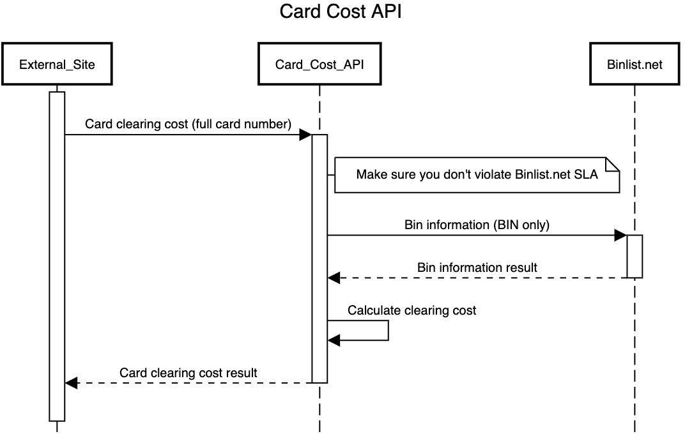

# Card Cost Service

## Introduction
**Card Cost Service** is an application that provides with two functionalities:
* a REST CRUD operation for the Country Clearing Cost
* a Service which can be given with a card number that will utilize the information 
  provided by this public API [BinList](https://binlist.net/)

### Tools used
* Java 11
* Maven
* Spring (Security, Validation & Caching) and SpringBoot
* Hibernate & SpringData
* H2 Database (in-memory)
* JUnit 5 Unit & Integration Tests
* Docker containerization and a docker-compose environment
* GitHub Action CI/CD

---

### Country Clearing Cost Service
The **Card Cost Service** provides with a simple CRUD operation for creating, retrieving, updating and deleting
a [CountryClearingCost](src/main/java/com/valyo95/microservices/cardcostservice/entity/CountryClearingCost.java) records.

#### CountryClearingCost
```
- countryCode : an ISO 3166-1 alpha-2 code (two-letter country code)
- cost        : Positive decimal that show the clearing cost of the country
```

Currently, the Country Clearing Cost does not contain any information about the cost's currency.
This could be implied by the country code as each country should have its own currency.

The CRUD operations are fully validated with the bean validation support provided by the
`spring-boot-starter-validation` dependency.

This means that:
* **country code** - should be exactly 2 two letter and should be a valid country code 
  (the validation uses the Java's Locale.getISOCountries()) to fetch all the country codes and check if the given **country code**
  is  valid one (see [CountryValidator.java](src/main/java/com/valyo95/microservices/cardcostservice/validators/CountryValidator.java)).
  Also the country code is not case sensitive, so `GR` and `gr` is exactly the same for the CRUD's behaviour.
* **cost** - should be a zero or positive decimal number

A set of records is automatically loaded into the database when the application starts

| Card issuing country | Clearing Cost |
|----------------------|---------------|
| US                   | 5             |
| GR                   | 15            |

The endpoint can be found under the `/country-cost` path.


#### Default Clearing Cost Value
There also exists a default clearing cost value for all the other countries that are not configured in the database.

The value is initially set from the [application.yml](src/main/resources/application.yml)
by the `card-cost.defaultClearingCost` property. This means that it can be pre-configured by the user before starting the application.

In a production environment restarting the whole server in order to change the default clearing cost value is not feasible.

That's why a special endpoint is available only to the users with the `ADMIN` role.
It can be found under `/admin/defaultClearingCost` and requires a `POST` with the following JSON structure
```json
{
  "cost" : "127"
}
```

---

### Card Cost Service

#### Domain
A credit card number is also called PAN.
The PAN is a 16 digit number displayed on one side of the card. 
The first 6 digits of a payment card number (credit cards, debit cards, etc.) are known as the Issuer Identification Numbers (IIN), previously known as Bank Identification Number (BIN).
These identify the institution that issued the card to the card holder.

#### Implementation

The **Card Cost Service** takes a PAN, extracts the BIN number,
calls the public [Binlist API](https://binlist.net/) to get the Bin information result and calculates the clearing cost
of the card.

The card clearing cost calculation is depicted in the following diagram:


The **Card Cost Service** API can be found under `/payment-cards-cost` and supports with the following action:
a POST on `/payment-cards-cost` of the following JSON:
```json
{
  "card_number" : <pan>
}
```
should respond with a response
```json
{
  "countryCode": <iso2_code>,
  "cost": <decimal>
}
```

---
The BIN information obviously doesn't change frequently. This can be used to reduce the number of calls to the Binlist API.

The **Card Cost Service** does this by caching the Bin Response by using [Spring Cache](https://docs.spring.io/spring-framework/docs/4.3.x/spring-framework-reference/html/cache.html)

The cache is cleared on a specific interval that can be defined by the user in the [application.yml](src/main/resources/application.yml)
by overwriting the `binlist.api.clearBinCacheInterval` property.

---

## Application security
The **Card Cost Service** is secured by the [Spring Security](https://spring.io/projects/spring-security) and required
a basic authentication that uses a *username* and a *password* to authenticate.

Two default users are programmatically configured:

| username | password | role  |
|----------|----------|-------|
| user     | user     | USER  |
| admin    | admin    | ADMIN |

For more info check the [SecurityConfig.java](src/main/java/com/valyo95/microservices/cardcostservice/config/SecurityConfig.java).